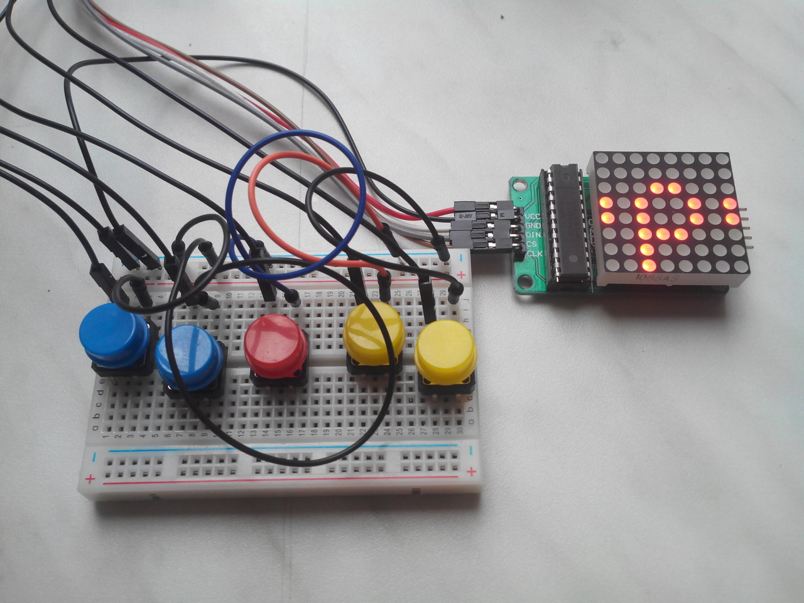

Arcade Locker
=============

This project uses a standard school locker with two 8*8 holes grids. 5 mm LEDs fits beautifully in those holes, small tactile switches too, a LCD display can be added in the name's tag space, thus a boring locker can be easily transformed into a multi-game arcade cabinet. Enjoy! (menus only in French for now)

*First prototype:*

This project is licensed under the terms of the MIT license. Check [`LICENSE.md`](LICENSE.md) for more informations.

Features
--------

* Main menu (LCD + Matrix):
  * 1 player games: **(not currently implemented)**
    * Breakout
    * Race
    * Snake
  * 2 player games: **(not currently implemented)**
    * Pong
    * Tron/Snake
  * About screen with hidden option menu **(not currently implemented)**
* Event-driven system
* High-scores logging **(not currently implemented)**
* Sounds **(not currently implemented)**
* Alarm when opening locker without pressing a predefined sequence of buttons
* Automatic standby based on the time

Requirements
------------

* [Arduino (I use a Nano with an ATmega328)](http://www.banggood.com/ATmega328P-Nano-V3-Controller-Board-Compatible-Arduino-p-940937.html)
* [MAX7219/MAX7221 with 8*8 LED matrix](http://www.banggood.com/MAX7219-Dot-Matrix-MCU-LED-Display-Control-Module-Kit-For-Arduino-p-915478.html)
* [I2C 16*8 LCD display](http://www.banggood.com/IIC-I2C-1602-Blue-Backlight-LCD-Display-Module-For-Arduino-p-950726.html) (can work without but best to have it for ease of navigation) **(not currently implemented)**
* 5 momentary pushbuttons
* [DS3231 I2C RTC](http://www.banggood.com/DS3231-AT24C32-IIC-High-Precision-Real-Time-Clock-Module-For-Arduino-p-81066.html) *(optional)* **(not currently implemented)**
* Piezoelectric buzzer *(optional)* **(not currently implemented)**
* Photocell (LDR) *(optional)* **(not currently implemented)**

Please look at [`config.h`](src/config.h) to configure the system and pins

Compilation
-----------

I actually use [Arturo](https://github.com/scottdarch/Arturo) to compile the sketck. If you use the Arduino IDE, you must:

* Install the LedControl library (copy [`lib/LedControl`](lib/LedControl) directory in your `libraries` folder or use the Library Manager (Arduino >= 1.6.2))
* Add `#include <LedControl.h>` at the top of [`src/ArcadeLocker.ino`](src/ArcadeLocker.ino)
* Put all files in [`src`](src) in a directory named `ArcadeLocker`
